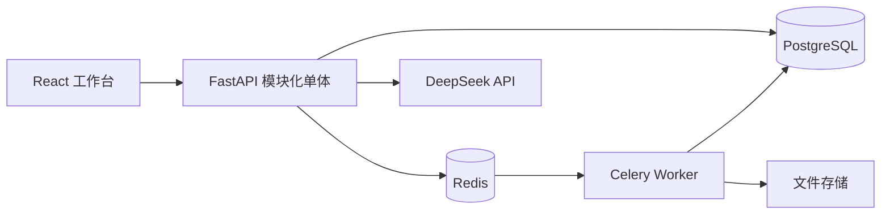

# 架构与设计决策

## 系统定位

系统是单机构、多角色的期刊财务运营平台。边界包括编辑部财务数据导入、规则处理、人工复核、审批、导出和归档；不包含真实支付、电子发票开具或学校统一身份认证。

## 模块边界

- 身份与权限：登录、会话、四角色RBAC和字段可见性。
- 财务领域：三类记录、费用规则、统一批次和状态机。
- 工作流：校验异常、复核、审批、任务、评论和版本导出。
- 集成：Excel/CSV、PDF解析、期刊网关、Celery异步任务。
- AI：制度检索、只读业务工具、结构化建议、人工确认和评测日志。
- 治理：文件完整性、审计事件、请求ID、安全响应头和运维健康检查。

## 关键决策

### 模块化单体而非微服务

当前业务由一个小团队、一个数据库事务边界和有限吞吐组成。模块化单体更易测试、部署和追踪；Celery仅隔离耗时任务，不人为拆分网络服务。

### PostgreSQL 是事实来源

Excel/CSV只承担交换格式。数据库唯一约束、事务和版本字段解决原型中文件覆盖、并发写入和历史不可追踪问题。

### 统一批次状态机

三条财务线共用状态与审批门禁。任何跳过复核或审批的转换返回 `409`；仍有开放异常时不能提交审批。

### AI最小权限

模型只接收制度片段和经过授权的业务摘要。模型不能获得数据库连接、文件路径或审批工具。写操作被表达为 `proposed_action`，由原请求用户确认后才由后端执行白名单工具。

## 威胁模型与安全边界

保护资产包括账号、身份/税务信息、财务记录、导出文件、模型凭证和审计事件。主要威胁为越权访问、CSRF、恶意上传、路径遍历、SSRF、提示注入、敏感信息泄露和审批绕过。

信任边界：浏览器输入、上传文件、期刊网页和检索文档均不可信；FastAPI校验后才能进入领域服务。DeepSeek输出只是建议，不作为授权依据。详细控制见 `docs/SECURITY.md`。

## 已知风险

- 本地文件卷不提供对象存储级冗余，真实部署应接入S3兼容存储并配置生命周期。
- 演示环境使用内置账号；生产必须接入机构身份源或执行独立密码治理。
- 关键词检索适合当前小规模SOP，文档增长后需根据评测升级混合检索。
- 期刊采集适配器必须遵守目标网站条款、访问频率和公开接口约束。

## 变更历史

### 2026-08-13 - 企业级2.0重构

**变更内容**：新增React/FastAPI应用、结构化数据库、异步任务、RBAC、审批审计、AI副驾、容器化、测试和技术文档。

**变更理由**：把功能脚本升级为可部署、可解释、可验证的完整业务闭环。

**影响范围**：新增 `server/`、`web/`、部署与CI配置；原型代码保留作迁移参照，未覆盖现有未提交修改。
