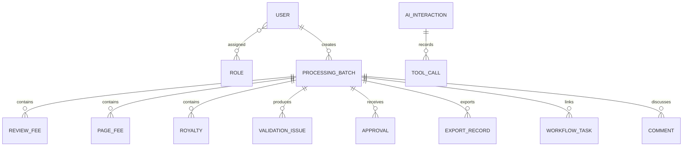

# 数据模型

## 核心关系

金额使用 `NUMERIC(12,2)`，避免浮点误差。财务记录包含 `revision`，更新时要求客户端提交已读取版本；版本不一致返回 `409`。批次包含业务类型、状态、行数、异常数和整体版本。

## 数据生命周期

1. 源文件随机命名保存，记录原名、大小、MIME、SHA-256和上传人。
2. Worker将内容转换为结构化财务记录。
3. 规则服务生成异常，人工解决或有依据地忽略。
4. 审批记录只追加；批准后生成带版本的导出记录。
5. 审计事件只提供查询接口，不提供更新和删除接口。

## 迁移

Alembic 是唯一数据库结构变更入口。`20260813_0001` 建立初始模型；生产升级先备份 PostgreSQL，再执行 `alembic upgrade head`。Excel历史数据应通过正常导入流程迁移，以便生成校验和审计证据。
